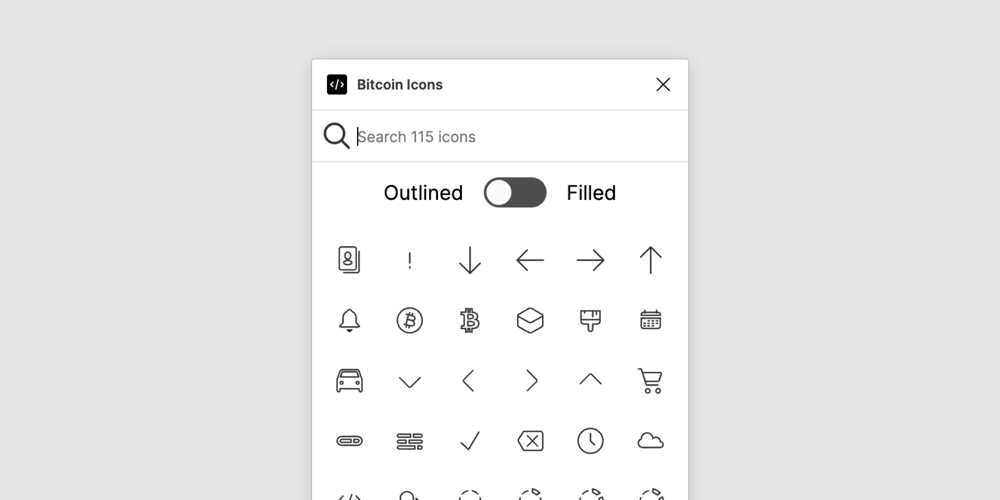

# Bitcoin Icons (WIP)

Bitcoin Icons is an open-source/open-design set of icons made for Bitcoin centric applications. Included are general icons most applications need like arrows and a home icon, and maybe more importantly Bitcoin-specific icons like a wallet, keys, miner and Bitcoin symbols.

Icons are available as a [public Figma community file](https://www.figma.com/community/file/948545404023677970/Bitcoin-icon-set) for design work, with a [companion Figma plugin](https://www.figma.com/community/plugin/1087677534293009133/Bitcoin-Icons) for convenient browsing and insertion. This repository contains icon exports as SVGs for implementation.

For requests, please leave a comment on the Figma file or post an issue to this repo. This could be new icons, improvements to existing icons, more style or export formats, or anything else. Just reach out.

Bitcoin Icons is a sister project of the [Bitcoin Wallet UI Kit](https://www.figma.com/file/VB3GQdAnhl8yta44DY3PSV/Bitcoin-Wallet-UI-Kit) created by [GBKS](https://github.com/GBKS).

## Contributing

For info on how to contribute please see the [contribution guidelines](CONTRIBUTING.md). Also see details on the [release process](RELEASES.md).

## SVG Download

You can download all icons for local use from the [releases page](https://github.com/BitcoinDesign/Bitcoin-Icons/releases). 

## Node Module

The node module is still in development. For now, you can install it and then pull
the SVGs into a build system such as Gulp. In the future, there may be more options
for importing the icons, such as font files, javascript imports, etc.

To install the node module pre-release version, run:

```
npm install @bitcoin-design/bitcoin-icons
```

## React module

[](https://www.npmjs.com/package/@bitcoin-design/bitcoin-icons-react)
[](https://www.npmjs.com/package/@bitcoin-design/bitcoin-icons-react)

First, install `@bitcoin-design/bitcoin-icons-react` from npm:

```sh
npm install @bitcoin-design/bitcoin-icons-react
```

Now each icon can be imported individually as a React component:

```js
import { BitcoinIcon } from '@bitcoin-design/bitcoin-icons-react/filled'

function MyComponent() {
  return (
    <div>
      <BitcoinIcon style={{height: "5px", width: "5px", color: '#F7931A' }} />
      <p>...</p>
    </div>
  )
}
```

The outline icons can be imported from `@bitcoin-design/bitcoin-icons-react/outline`, and the filled icons can be imported from `@bitcoin-design/bitcoin-icons-react/filled`.

Icons use an upper camel case naming convention and are always suffixed with the word `Icon`.


## Vue module

[](https://www.npmjs.com/package/@bitcoin-design/bitcoin-icons-vue)
[](https://www.npmjs.com/package/@bitcoin-design/bitcoin-icons-vue)

*Note that this library currently only supports Vue 3.*

First, install `@bitcoin-design/bitcoin-icons-vue` from npm:

```sh
npm install @bitcoin-design/bitcoin-icons-vue
```

Now each icon can be imported individually as a Vue component:

```vue
<template>
  <div>
    <BitcoinIcon style="height:5px;width:5px;color:#F7931A" />
    <p>...</p>
  </div>
</template>

<script>
import { BitcoinIcon } from '@bitcoin-design/bitcoin-icons-vue/filled'

export default {
  components: { BitcoinIcon }
}
</script>
```

The outline icons can be imported from `@bitcoin-design/bitcoin-icons-vue/outline`, and the filled icons can be imported from `@bitcoin-design/bitcoin-icons-vue/filled`.

Icons use an upper camel case naming convention and are always suffixed with the word `Icon`.


## SVG module

[](https://www.npmjs.com/package/@bitcoin-design/bitcoin-icons-svg)
[](https://www.npmjs.com/package/@bitcoin-design/bitcoin-icons-svg)

First, install `@bitcoin-design/bitcoin-icons-svg` from npm:

```sh
npm install @bitcoin-design/bitcoin-icons-svg
```

Now each icon can be imported individually as a Vue component:

```js
import { BitcoinIcon } from '@bitcoin-design/bitcoin-icons-svg/filled'

console.log(BitcoinIcon)
// ==>
// {
//   name: 'bitcoin',
//   svg: '<svg width="24" height="24" viewBox="0 0 24 24" fill="none" xmlns="http://www.w3.org/2000/svg">...</svg>'
// };
```

The outline icons can be imported from `@bitcoin-design/bitcoin-icons-svg/outline`, and the filled icons can be imported from `@bitcoin-design/bitcoin-icons-svg/filled`.

Icons use an upper camel case naming convention and are always suffixed with the word `Icon`.


## Figma plugin



The source for the [Figma plugin](https://www.figma.com/community/plugin/1087677534293009133/Bitcoin-Icons) can be found in [this repository](https://github.com/GBKS/figma-bitcoin-icons).